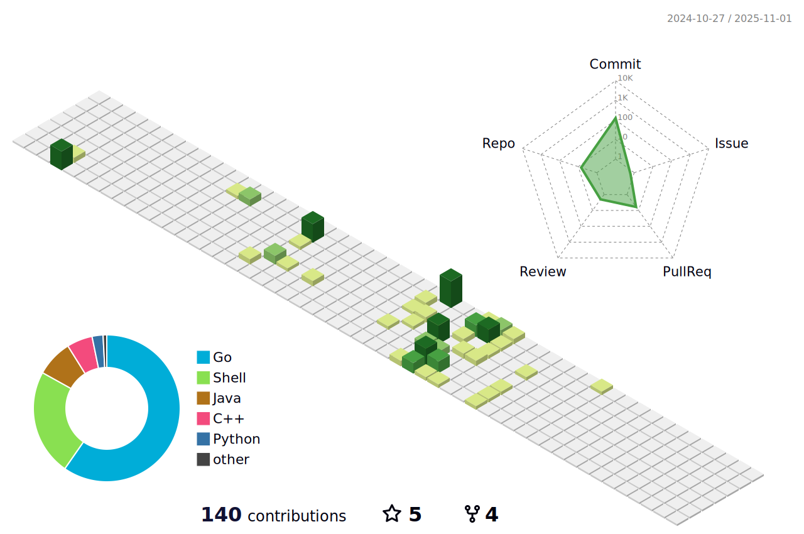

  
  

---

<!--   -->

<h1 align="center">Hi 👋, I'm Raphael</h1>
<h3 align="center">A passionate backend developer</h3>

- 🔭 I’m currently working on [google-places-api](link)

- 🌱 I’m currently learning **C, C++**

  
